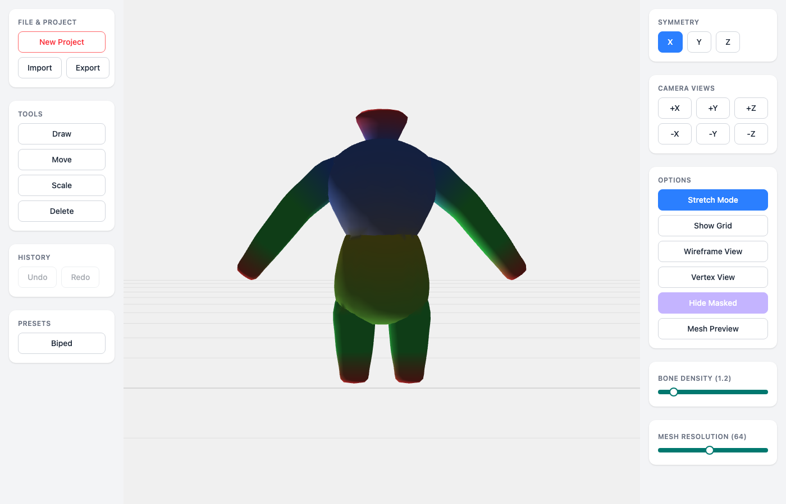
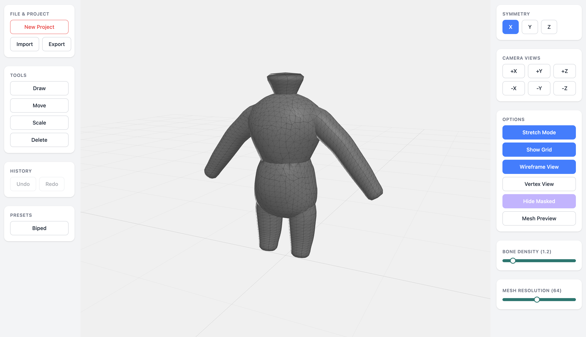
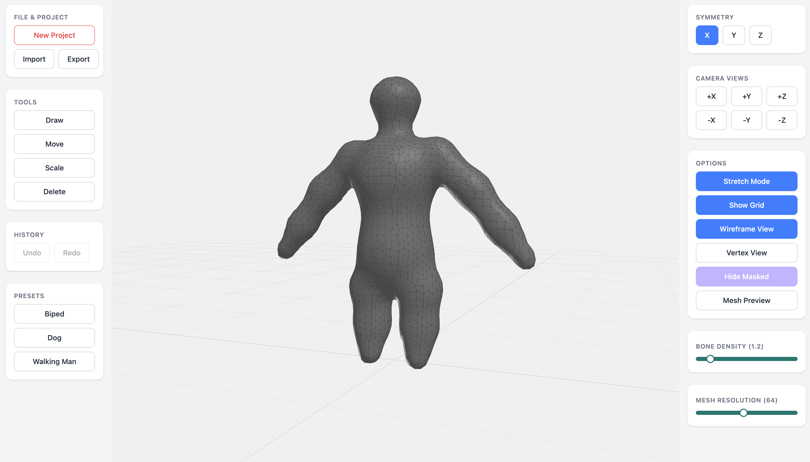

# B-Mesh — 3D Mesh Editor

본(Bone) 기반 절차적 메시 생성 에디터. Cross-section Lofting과 로컬 SDF 하이브리드 알고리즘으로 본 구조에서 3D 메시를 실시간 생성합니다.





## 기술 스택

| 영역 | 기술 |
|------|------|
| 프레임워크 | React 19 + TypeScript |
| 3D 엔진 | Three.js |
| 상태 관리 | Zustand + Immer |
| 스타일링 | Tailwind CSS 4 |
| 빌드 | Vite 6 |

## 메시 생성 알고리즘

B-Mesh 논문(Ji et al. 2010)에서 영감을 받은 하이브리드 방식:

```
Bone Skeleton → Chain Detection → Cross-section Lofting (팔다리)
                                → Local SDF + Marching Cubes (분기점)
                                → Vertex Welding → Taubin Smoothing → Mesh
```

### 팔다리: Cross-section Lofting
- 본 체인을 따라 12각형 단면 프레임을 행진(march)
- 인접 프레임을 쿼드 면으로 연결하여 튜브 메시 생성
- 본 방향을 따르는 자연스러운 edge flow

### 분기점: 로컬 SDF 하이브리드
- 분기 노드(어깨/골반 등) 주변에만 SDF 필드 생성
- 소규모 Marching Cubes(해상도 32)로 자연스러운 접합 메시 추출
- 튜브와 SDF 메시를 정점 용접(vertex welding)으로 봉합

### 후처리
- **정점 용접**: 공간 해싱 + Union-Find로 가까운 정점 자동 병합
- **퇴화 삼각형 제거**: 면적 0인 삼각형 정리
- **Taubin 스무딩**: λ|μ 교대 적용으로 수축 없이 18회 스무딩

## 주요 기능

### 스컬프팅 도구

| 도구 | 단축키 | 기능 |
|------|--------|------|
| Draw | `D` | 클릭 위치에 본 추가 |
| Move | `G` | 본 드래그 이동 |
| Scale | `S` | 본 반경 조절 |
| Delete | `X` | 본 삭제 |

### 편집 기능
- **Undo/Redo** — `Ctrl+Z` / `Ctrl+Shift+Z` (커맨드 패턴)
- **X/Y/Z 대칭 편집** — 미러링 자동 적용
- **6방향 카메라 프리셋** — +X, -X, +Y, -Y, +Z, -Z

### 렌더링 모드
- **Solid** — 본 영역 색상 셰이더 (GLSL)
- **Wireframe** — 와이어프레임 오버레이
- **Vertex** — 정점 포인트 표시
- **Mesh Preview** — 스무스 노멀 프리뷰

### 프리셋
- **Biped** — 인간형 (머리/상체/팔/다리)
- **Quadruped** — 4족 보행 동물
- **Sphere** — 단일 구체

### 파일 I/O
- `.bmesh` 프로젝트 저장/불러오기
- OBJ/STL 내보내기
- localStorage 자동 저장 (30초)

## 실행

```bash
pnpm install
pnpm dev
```

## 프로젝트 구조

```
src/
├── engine/            # Three.js 렌더링 엔진
│   ├── SceneManager.ts
│   ├── CameraController.ts
│   ├── MeshRenderer.ts
│   ├── RaycastManager.ts
│   └── GridHelper.ts
├── mesh/              # 본/메시 시스템
│   ├── BMeshLofting.ts    # 하이브리드 메시 생성 (핵심)
│   ├── BoneSystem.ts
│   ├── SDFGenerator.ts
│   ├── MarchingCubes.ts
│   ├── SculptTools.ts
│   ├── SymmetryManager.ts
│   └── Presets.ts
├── ui/                # React UI
│   ├── EditorLayout.tsx
│   ├── panels/
│   └── components/
├── store/             # Zustand 상태 관리
├── io/                # 파일 I/O
├── core/              # EventBus, CommandManager
└── App.tsx
```

## 파라미터

| 파라미터 | 범위 | 설명 |
|---------|------|------|
| Bone Density | 0.1 ~ 5.0 | 본 영향 반경 배율 |
| Mesh Resolution | 8 ~ 128 | 본당 세그먼트 수 (resolution / 8) |

## 참고 논문

- Ji, Z., Liu, L., Wang, Y. (2010). *"B-Mesh: A Modeling System for Base Meshes of 3D Articulated Shapes."* Computer Graphics Forum, 29(7).
- Baerentzen, J.A. et al. (2012). *"Converting Skeletal Structures to Quad Dominant Meshes."* Computers & Graphics, 36(5).

## 라이선스

MIT
